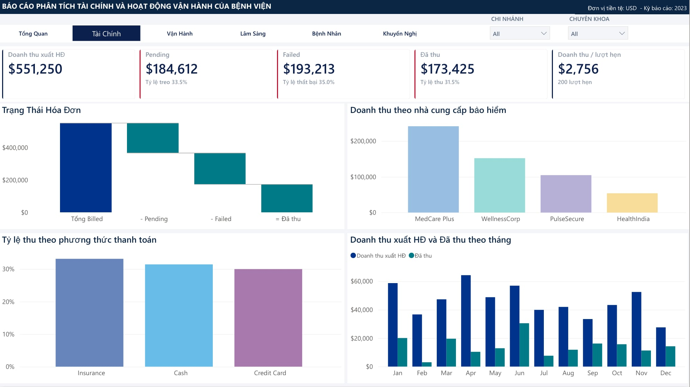
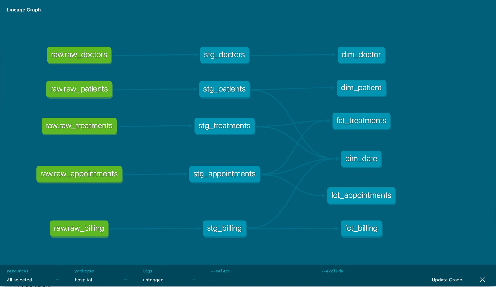

# 🏥 Hospital Data Pipeline



End-to-end analytics pipeline for hospital operations data: CSV extracts are loaded
into **Snowflake**, transformed into a **star schema** with **dbt**, covered by data
quality tests, refreshed daily via cron, and visualised in **Power BI**.

> Portfolio project demonstrating a modern **Analytics Engineering** workflow
> (ELT + Medallion architecture: RAW → STAGING → ANALYTICS).

📊 **[Live dbt docs — lineage & column-level documentation](https://datphamc.github.io/hospital-data-pipeline/dbt-docs/)**

> 📘 **Mới bắt đầu?** Đọc [docs/HUONG_DAN.md](docs/HUONG_DAN.md) — hướng dẫn từng bước
> đi theo dòng chảy dữ liệu (CSV → RAW → STAGING → ANALYTICS → Power BI).

## 🏗️ Kiến trúc

```
   CSV (ERP / Excel export)
            │
            ▼  Python + snowflake-connector
   ┌─────────────────┐
   │ Snowflake  RAW  │   dữ liệu thô, full-refresh
   └────────┬────────┘
            │  dbt (staging models)
   ┌─────────────────┐
   │   STAGING       │   làm sạch, ép kiểu, khử trùng lặp
   └────────┬────────┘
            │  dbt (marts — star schema)
   ┌─────────────────┐
   │   ANALYTICS     │   dim_* + fct_*  (sẵn sàng cho BI)
   └────────┬────────┘
            │
            ▼
       Power BI dashboard
```

**Orchestration:** cron gọi `run_pipeline.sh` mỗi ngày (ingest → dbt run → dbt test).

### Lineage (dbt DAG)



5 source (RAW) → 5 model staging → 6 model marts. Xem bản tương tác kèm mô tả từng cột
tại [dbt docs](https://datphamc.github.io/hospital-data-pipeline/dbt-docs/).

## 🗂️ Mô hình dữ liệu (Star Schema)

| Loại | Bảng | Grain |
|------|------|-------|
| Dimension | `dim_patient` | 1 bệnh nhân |
| Dimension | `dim_doctor` | 1 bác sĩ |
| Dimension | `dim_date` | 1 ngày |
| Fact | `fct_appointments` | 1 lịch hẹn |
| Fact | `fct_treatments` | 1 lần điều trị |
| Fact | `fct_billing` | 1 hóa đơn |

Nguồn: `patients`, `doctors`, `appointments`, `treatments`, `billing` (CSV).

## ⚙️ Tech Stack

| Layer | Tool |
|-------|------|
| Ingestion | Python + `snowflake-connector-python` |
| Environment / packaging | uv (Astral) — `pyproject.toml` + `uv.lock` |
| Storage | Snowflake (RAW → STAGING → ANALYTICS) |
| Transformation | dbt-core 1.8.7 (Snowflake adapter) |
| Orchestration | cron + `run_pipeline.sh` |
| BI | Power BI Desktop |
| Version control | Git / GitHub |

## 📈 Kết quả

Lần chạy thành công cuối: **2026-06-20** (sau đó Snowflake trial hết hạn).

| Lệnh | Kết quả | Thời gian |
|------|---------|-----------|
| `dbt run` | PASS **11/11** models, 0 error | 4.88s |
| `dbt test` | PASS **28/28** tests, 0 error | 4.35s |

- **11 models** = 5 staging (materialized `view`) + 6 marts (materialized `table`).
- **28 tests** = 11 `unique` + 11 `not_null` + 6 `relationships`.

> ℹ️ Sau lần chạy trên, repo được bổ sung thêm 3 test `accepted_values`
> (tổng **31 test** trong code). 3 test mới này **chưa** được chạy với dữ liệu thật
> vì trial đã hết hạn — chỉ mới verify qua `dbt parse`.

🔗 **dbt docs (lineage + mô tả từng model/cột):**
https://datphamc.github.io/hospital-data-pipeline/dbt-docs/

### Dữ liệu

| Bảng nguồn | Số dòng |
|------------|---------|
| `patients` | 50 |
| `doctors` | 10 |
| `appointments` | 200 |
| `treatments` | 200 |
| `billing` | 200 |

- Khoảng thời gian: **2021-01-23 → 2023-12-30**
- Chất lượng: **0 ô trống**, **0 dòng mồ côi (orphan)** giữa cả 5 bảng
- Quan hệ: mỗi appointment có đúng 1 treatment và 1 bill

### Phân bố chính

| Chiều | Phân bố |
|-------|---------|
| `appointments.status` | No-show 52 · Scheduled 51 · Cancelled 51 · Completed 46 |
| `billing.payment_status` | Pending 69 · Failed 67 · Paid 64 |
| `billing.payment_method` | Credit Card 75 · Insurance 64 · Cash 61 |
| `treatments.treatment_type` | Chemotherapy 49 · X-Ray 41 · ECG 38 · MRI 36 · Physiotherapy 36 |

Tỷ lệ **no-show 26.0%**, **cancelled 25.5%** — xem mục *Known limitations* bên dưới
về ý nghĩa của hai con số này.

## 🚀 Hướng dẫn chạy

### 1. Cài đặt (dùng [uv](https://docs.astral.sh/uv/))
```bash
# Cài uv 1 lần (nếu chưa có)
curl -LsSf https://astral.sh/uv/install.sh | sh   # hoặc: brew install uv

# Tạo môi trường + cài dependencies từ pyproject.toml
uv sync
```
> `uv sync` tự tạo `.venv/` và đồng bộ theo `uv.lock`. Sau đó chạy lệnh qua
> `uv run <lệnh>` (không cần `activate`).

### 2. Cấu hình Snowflake
1. Đăng ký trial tại [signup.snowflake.com](https://signup.snowflake.com) (Standard edition).
2. Mở Snowsight → **Worksheets** → chạy file [`setup/snowflake_setup.sql`](setup/snowflake_setup.sql)
   bằng role `ACCOUNTADMIN`. File này tạo database `HOSPITAL`, 3 schema
   (RAW/STAGING/ANALYTICS), warehouse `HOSPITAL_WH` và role `DBT_ROLE`.
3. Lấy **Account Identifier**: Snowsight → menu account (góc dưới trái) →
   *View account details* → copy (dạng `ORGNAME-ACCOUNT_NAME`).

Tạo file cấu hình từ mẫu rồi điền thông tin:
```bash
cp .env.example .env                 # điền credentials Snowflake
cp dbt/profiles.yml.example dbt/profiles.yml
```

### 3. Chạy pipeline
```bash
./run_pipeline.sh
```
Hoặc từng bước:
```bash
uv run python ingestion/load_to_raw.py                       # CSV -> RAW
uv run dbt run  --project-dir dbt --profiles-dir dbt          # RAW -> STAGING -> ANALYTICS
uv run dbt test --project-dir dbt --profiles-dir dbt          # data quality tests
```

### 4. Xem lineage
```bash
uv run dbt docs generate --project-dir dbt --profiles-dir dbt
uv run dbt docs serve    --project-dir dbt --profiles-dir dbt
```
Bản snapshot đã build sẵn nằm ở [`docs/dbt-docs/`](docs/dbt-docs/) và được publish
qua GitHub Pages (không cần kết nối Snowflake để xem).

### 5. Lên lịch hằng ngày (cron, 6h sáng)
```cron
0 6 * * * cd /path/to/hospital-data-pipeline && ./run_pipeline.sh >> logs/pipeline.log 2>&1
```

### 6. Power BI
Connect → Snowflake → database `HOSPITAL`, schema `ANALYTICS` → import các bảng
`dim_*` / `fct_*` → dựng dashboard KPI. File mẫu: [`dashboard/hospital_dashboard.pbix`](dashboard/hospital_dashboard.pbix).

## 📊 KPI trên dashboard
- Số lượt khám theo ngày / khoa / bác sĩ
- Tỷ lệ no-show & hủy lịch
- Doanh thu & công nợ (paid vs pending) theo thời gian
- Phân bố loại điều trị, chi phí trung bình
- Phân bố độ tuổi / giới tính bệnh nhân, nhà bảo hiểm

## 📁 Cấu trúc thư mục
```
.
├── data/                # 5 file CSV nguồn (synthetic)
├── ingestion/           # Python: CSV -> Snowflake RAW
├── dbt/                 # staging + marts (star schema) + tests
│   ├── models/staging/  # 5 view: làm sạch, ép kiểu, khử trùng lặp
│   ├── models/marts/    # 6 table: dim_* + fct_*
│   └── macros/          # override generate_schema_name
├── setup/               # snowflake_setup.sql (chạy 1 lần bằng ACCOUNTADMIN)
├── dashboard/           # file .pbix
├── docs/                # HUONG_DAN.md, ảnh, snapshot dbt docs (GitHub Pages)
├── logs/                # output của cron (gitignored)
├── run_pipeline.sh      # orchestration 1 lệnh
└── README.md
```

## ⚠️ Known limitations & Next steps

- **Dữ liệu synthetic:** 26% No-show và 25.5% Cancelled vẫn có điều trị + hóa đơn
  đi kèm, nên KPI doanh thu chỉ mang tính minh họa. Production cần lọc
  `status = 'Completed'` trước khi tính doanh thu.
- **PII chưa che:** `dim_patient` còn chứa email / số điện thoại / địa chỉ / số bảo hiểm
  → cần áp Snowflake masking policy trước khi mở cho người dùng cuối.
- **`dim_patient.age` không tái lập được:** đang tính bằng `current_date()` nên kết quả
  đổi theo ngày chạy → nên để tầng BI tự tính từ `date_of_birth`.
- **`dim_date` spine cố định `generator(5000)`:** nên tính số dòng theo `datediff`
  giữa min/max date thay vì hard-code.
- **`_sources.yml` hard-code `database: HOSPITAL`** trong khi `profiles.yml` dùng
  `env_var` → không đổi được database qua biến môi trường.
- **Snowflake trial đã hết hạn** (bản chạy thành công cuối: 2026-06-20).
  Roadmap: thêm **DuckDB target** để pipeline chạy được offline, không phụ thuộc trial.

## ⚠️ Lưu ý bảo mật
- `.env` và `dbt/profiles.yml` chứa secret → **không commit** (đã có trong `.gitignore`).
- Toàn bộ dữ liệu trong `data/` là **synthetic**, không phải dữ liệu bệnh nhân thật.
- Nếu dùng dữ liệu thật, hãy ẩn danh các cột nhạy cảm trước khi public.
